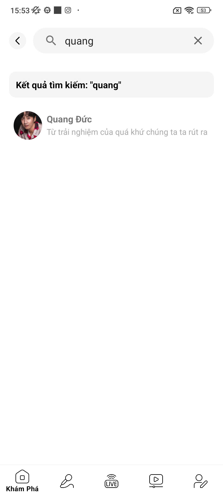

Các tính năng :
- Phát nhạc & ghi âm bài hát cover
- Đăng bài hát và tương tác: Người dùng có thể đăng bài cover, thả tim, bình luận, và chia sẻ bài hát. 
- Quản lý bài cover.
- Tham gia Khóa học hát.
- Nhắn tin bằng socket.io
- Người dùng được chia theo rank để được đăng bài và vip để hát được những bài hát mất phí.
- Ứng dụng có hiệu ứng annotation cho tính năng vip, tạo giao diện đẹp mắt, dễ sử dụng.
- Livestream ca hát: Phát trực tiếp giọng hát qua Wowza Streaming Cloud, hỗ trợ bình luận và tương tác trong thời gian thực. 
- Phản hồi đến Quản trị viên( Yêu cầu bài hát, phản ánh, khiếu nại)
- Gợi ý bài hát thông minh: Ứng dụng kết hợp lọc nội dung và lọc cộng tác để đề xuất bài hát theo sở thích người dùng. 
- Nâng cấp tài khoản VIP: Tích hợp Google Play Billing giúp người dùng dễ dàng đăng ký, gia hạn hoặc hủy VIP. 
- Thông báo theo thời gian thực: Gửi thông báo về bài hát mới, follow, bình luận… qua Firebase Cloud Messaging (FCM). 
- Tìm kiếm nhanh với Elasticsearch: Hệ thống hỗ trợ tìm kiếm bài hát và người dùng siêu tốc độ, chính xác. 
- Trang quản trị riêng cho Admin: Quản lý bài hát, người dùng, duyệt nội dung… qua giao diện web hiện đại.
-  deploy trang Web và ứng dụng đã chạy nội bộ trên google play console.

Một số màn hình của app:

